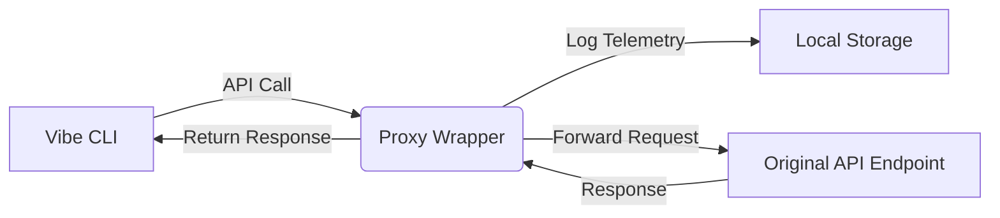

# Technical Design: Token Telemetry for Vibe CLI

## 1. Architecture Overview

### 1.1 High-Level Design

A **standalone proxy wrapper** intercepts API calls from Vibe CLI, logs telemetry, computes cost, and forwards requests to the original endpoint.



### 1.2 Components


| Component            | Responsibility                           | Implementation               |
| -------------------- | ---------------------------------------- | ---------------------------- |
| **Proxy Wrapper**    | Intercept, log, forward API calls.       | Python script (HTTP server). |
| **Telemetry Logger** | Record metrics to local storage.         | SQLite/JSON.                 |
| **Cost Calculator**  | Compute cost based on Mistral’s pricing. | Python function.             |
| **Reporter**         | Generate summaries from log data.        | CLI tool.                    |


---

## 2. Data Model

### 2.1 Telemetry Log Schema


| Field             | Type    | Description                                    |
| ----------------- | ------- | ---------------------------------------------- |
| `timestamp`       | TEXT    | ISO 8601 timestamp.                            |
| `model`           | TEXT    | Name of the model used.                        |
| `endpoint`        | TEXT    | API endpoint URL.                              |
| `origin`          | TEXT    | Call initiator (`user`, `agent`, `sub-agent`). |
| `request_tokens`  | INTEGER | Number of tokens in the request.               |
| `response_tokens` | INTEGER | Number of tokens in the response.              |
| `processing_time` | REAL    | Time taken to process the request (seconds).   |
| `status_code`     | INTEGER | HTTP status code.                              |
| `cost`            | REAL    | Calculated cost for the call.                  |


### 2.2 Example Log Entry (SQLite)

```sql
INSERT INTO calls VALUES
('2026-05-19T12:34:56', 'mistral-medium', 'https://api.mistral.ai/v1/chat/completions',
 'user', 256, 512, 0.125, 200, 0.000576);
```

---

## 3. Implementation Details

### 3.1 Proxy Wrapper (Python)

#### **Dependencies**

- `http.server`, `requests`, `sqlite3` (standard library).
- Optional: `aiohttp` for async support.

#### **Key Functions**


| Function                                             | Description                                            |
| ---------------------------------------------------- | ------------------------------------------------------ |
| `start_proxy_server(port)`                           | Starts a local HTTP server to intercept API calls.     |
| `log_telemetry(data)`                                | Records telemetry data to local storage (SQLite/JSON). |
| `calculate_cost(model, input_tokens, output_tokens)` | Computes cost based on Mistral’s pricing.              |
| `generate_summary()`                                 | Generates a text-based summary from stored telemetry.  |


#### **Example Code Skeleton**

```python
from http.server import HTTPServer, BaseHTTPRequestHandler
import requests
import sqlite3
from datetime import datetime

# Initialize SQLite database
db = sqlite3.connect('telemetry.db')
cursor = db.cursor()
cursor.execute('''CREATE TABLE IF NOT EXISTS calls
                  (timestamp TEXT, model TEXT, endpoint TEXT,
                   origin TEXT, request_tokens INTEGER,
                   response_tokens INTEGER, processing_time REAL,
                   status_code INTEGER, cost REAL)''')

# Cost mapping (Mistral AI)
COST_MODEL = {
    "mistral-tiny": {"input": 0.25, "output": 0.75},
    "mistral-medium": {"input": 0.25, "output": 0.75},
    "mistral-large": {"input": 0.25, "output": 0.75},
}

class TelemetryHandler(BaseHTTPRequestHandler):
    def do_POST(self):
        # 1. Read request body
        content_length = int(self.headers['Content-Length'])
        post_data = self.rfile.read(content_length)

        # 2. Log telemetry (before forwarding)
        log_telemetry({
            "timestamp": datetime.now().isoformat(),
            "model": self.headers.get('model'),
            "endpoint": self.path,
            "origin": self.headers.get('origin'),
            "request_tokens": int(self.headers.get('request_tokens', 0)),
        })

        # 3. Forward request to original endpoint
        response = requests.post(
            "https://api.mistral.ai" + self.path,
            data=post_data,
            headers=self.headers
        )

        # 4. Log response telemetry
        usage = response.json().get('usage', {})
        log_telemetry({
            "response_tokens": usage.get('total_tokens', 0),
            "processing_time": response.elapsed.total_seconds(),
            "status_code": response.status_code,
            "cost": calculate_cost(
                self.headers.get('model'),
                self.headers.get('request_tokens'),
                usage.get('total_tokens', 0)
            )
        })

        # 5. Return response to caller
        self.send_response(response.status_code)
        self.end_headers()
        self.wfile.write(response.content)

def log_telemetry(data):
    cursor.execute('''INSERT INTO calls VALUES
                      (?, ?, ?, ?, ?, ?, ?, ?, ?)''',
                   (data['timestamp'], data['model'], data['endpoint'],
                    data['origin'], data['request_tokens'],
                    data['response_tokens'], data['processing_time'],
                    data['status_code'], data['cost']))
    db.commit()

def calculate_cost(model, input_tokens, output_tokens):
    if model not in COST_MODEL:
        return 0.0
    cost = (input_tokens / 1_000_000 * COST_MODEL[model]['input'] +
            output_tokens / 1_000_000 * COST_MODEL[model]['output'])
    return cost

def generate_summary():
    cursor.execute('''SELECT model, COUNT(*) as calls,
                      SUM(request_tokens) as input_tokens,
                      SUM(response_tokens) as output_tokens,
                      SUM(cost) as total_cost
                      FROM calls GROUP BY model''')
    results = cursor.fetchall()
    summary = "## Token Telemetry Summary\n\n"
    summary += f"- **Total API Calls**: {sum(row[1] for row in results)}\n"
    summary += f"- **Total Tokens**: {sum(row[2] + row[3] for row in results)} (Input: {sum(row[2] for row in results)}, Output: {sum(row[3] for row in results)})\n"
    summary += f"- **Total Cost**: ${sum(row[4] for row in results):.6f}\n\n"

    summary += "### Breakdown by Model\n"
    for row in results:
        summary += f"- **{row[0]}**: {row[1]} calls, {row[2]} input tokens, {row[3]} output tokens, ${row[4]:.6f}\n"

    cursor.execute('''SELECT origin, COUNT(*) as calls,
                      SUM(request_tokens) as input_tokens,
                      SUM(response_tokens) as output_tokens,
                      SUM(cost) as total_cost
                      FROM calls GROUP BY origin''')
    origin_results = cursor.fetchall()
    summary += "\n### Breakdown by Origin\n"
    for row in origin_results:
        summary += f"- **{row[0]}**: {row[1]} calls, {row[2]} input tokens, {row[3]} output tokens, ${row[4]:.6f}\n"
    return summary

# Start proxy server
if __name__ == "__main__":
    server = HTTPServer(('localhost', 8000), TelemetryHandler)
    print("Proxy server running on http://localhost:8000")
    server.serve_forever()
```

---

## 4. Integration with Vibe CLI

### 4.1 Setup

1. **Start the proxy server**:
  ```bash
   python telemetry_wrapper.py
  ```
2. **Override API endpoint**:
  ```bash
   export VIBE_API_ENDPOINT=http://localhost:8000
   vibe
  ```

### 4.2 Usage Workflow

1. Vibe CLI makes an API call to `http://localhost:8000`.
2. Proxy wrapper logs telemetry, computes cost, and forwards the request.
3. Response is returned to Vibe CLI.
4. After usage, generate a summary:
  ```bash
   python telemetry_reporter.py --summary
  ```

---

## 5. Error Handling

- **Non-Blocking**: If logging fails, the wrapper continues processing.
- **Error Logging**: Failures are logged to stderr (e.g., `logging.error`).

---

## 6. Reporting

### 6.1 CLI Reporter

```python
# telemetry_reporter.py
import sqlite3
from datetime import datetime

def generate_summary():
    # ... (same as above)
    with open('summary.txt', 'w') as f:
        f.write(summary)
    print(summary)

if __name__ == "__main__":
    generate_summary()
```

### 6.2 Example Output

```text
## Token Telemetry Summary (2026-05-19)

- **Total API Calls**: 42
- **Total Tokens**: 32,450 (Input: 12,000, Output: 20,450)
- **Total Cost**: $0.0243

### Breakdown by Model
- mistral-medium: 20 calls, 15,000 tokens (Input: 5,000, Output: 10,000), $0.01125
- mistral-large: 22 calls, 17,450 tokens (Input: 7,000, Output: 10,450), $0.01308

### Breakdown by Origin
- user: 30 calls, 25,000 tokens (Input: 10,000, Output: 15,000), $0.01875
- agent: 12 calls, 7,450 tokens (Input: 2,000, Output: 5,450), $0.00562
```

---

## 7. Testing Plan

1. **Unit Tests**:
  - Mock API calls to verify telemetry logging.
  - Test cost calculation for different token counts.
2. **Integration Tests**:
  - Run Vibe CLI with the proxy wrapper.
  - Verify telemetry data and cost calculations.
3. **Edge Cases**:
  - Invalid model names.
  - Failed API calls (e.g., 429 errors).

---

## 8. Future Enhancements

- Support for additional providers (e.g., OpenAI).
- Web dashboard for visualizing telemetry data.
- Export to CSV/JSON for external analysis.
